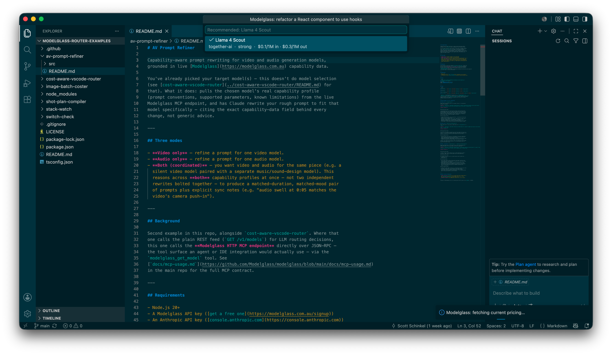
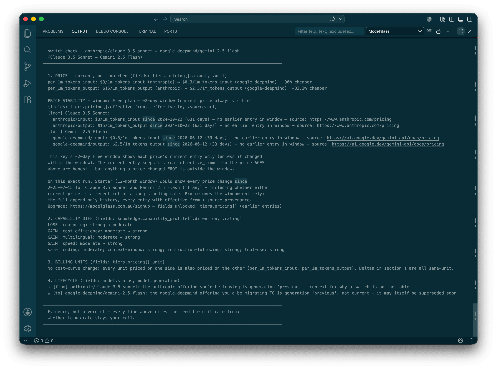

# Modelglass Cost-Aware Router

A VS Code extension that routes a task to the cheapest LLM that clears a
confirmed benchmark bar, using the live [Modelglass](https://modelglass.com.au)
pricing and capability feed. Since v0.3.0 it can also **execute the call
directly against your own provider key** — a fully client-side, BYOK
(bring-your-own-key) router: no Modelglass proxy in the request path, ever.



There are two distinct routing commands in this extension — see
[Commands](#commands) below for exactly how they differ. **Route Task** (the
original MVP command) only *recommends* a model; it never calls any provider
API. **Run Task** (new in v0.3.0) *executes* the call, using a provider key
you supply.

## Route Task to Cheapest Capable Model

1. Run **Modelglass: Route Task to Cheapest Capable Model** from the Command Palette.
2. Describe what you're about to do; the extension infers a starting task type
   (coding / writing / general) from your active file's language — always
   overridable.
3. It fetches the current LLM pricing/capability feed and recommends the
   cheapest model that clears the relevant quality bar — coding tasks are
   ranked by SWE-bench Verified, writing/general tasks by
   instruction-following rating. **Recommendation only — nothing is executed.**

## Run Task on Cheapest Capable Model (BYOK router — Starter / Pro)

1. Configure a provider key first — **Modelglass: Set Provider API Key** (see
   [Provider API keys](#provider-api-keys) below).
2. Run **Modelglass: Run Task on Cheapest Capable Model**, pick one of nine
   task categories (bug fix/debug, new code generation, terminal/CLI/DevOps,
   library-aware feature work, refactor, test generation, documentation
   generation, chat/explain, autocomplete), and describe the task.
3. The extension ranks your configured provider's models against
   Modelglass's live benchmark/capability feed (SWE-bench Pro/Verified,
   Terminal-Bench 2.1, Aider Polyglot/LiveCodeBench, or BigCodeBench,
   depending on category — with a qualitative capability-rating fallback for
   categories no benchmark covers well) and **calls the top-ranked model
   directly**, using your own key. Supports OpenAI, Anthropic, DeepSeek,
   xAI, Mistral, Groq, Together AI, and OpenRouter.
4. **Starter** (one configured key): one execution attempt. A failure
   (invalid key, rate limit, network/provider error) is reported clearly —
   no automatic retry.
5. **Pro** (multiple configured keys, via **Modelglass: Add Provider API
   Key**): on a failure, automatically retries the next-best-ranked model on
   a *different* configured provider (never the same provider twice), up to
   one attempt per configured provider. Pro also unlocks an optional
   `.modelglass/routing-rules.json` file in your workspace to override the
   default ranking per category — exclude a provider, force cheapest-first,
   or set an exact model priority order. A Starter user with a
   `routing-rules.json` present, or attempting to configure more than one
   provider key, gets a clear upgrade prompt rather than a silent failure.

## Install

From the Marketplace (once published): search **Modelglass Cost-Aware
Router** in VS Code's Extensions view, or run:

```bash
code --install-extension modelglass.cost-aware-router
```

From a `.vsix` file directly (e.g. for testing a pre-release build):

```bash
code --install-extension path/to/cost-aware-router-0.1.0.vsix
```

### First run

No account or setup needed: the extension silently provisions its own free
Modelglass API key the first time you run a command, stored in VS Code's
`SecretStorage` — never in a settings file or anything synced elsewhere.
Look in the **Modelglass** output channel (View → Output) to confirm it
provisioned successfully. If the API is unreachable, it offers to retry or
let you enter a key manually instead. This free Modelglass key is what
**Run Task** also checks against to determine Pro vs Starter access — it's
the same key, not a separate credential.

### Provider API keys

**Run Task** needs a key from whichever LLM provider(s) you want it to call
— these are entirely separate from the free Modelglass key above, and are
never sent to Modelglass, only to the provider itself.

- **Modelglass: Set Provider API Key** — the Starter flow: pick a provider,
  paste its key. Exclusive — setting a new provider's key replaces
  whichever one was configured before (with a confirmation warning).
- **Modelglass: Add Provider API Key** — the Pro flow: pick a provider,
  paste its key, *alongside* any other already-configured provider(s) —
  this is what builds the fallback chain. Adding a first key, or rotating
  an already-configured provider's own key, is never gated; adding a
  *second* simultaneous provider requires Pro.

Both store into VS Code's `SecretStorage`, same mechanism as the free
Modelglass key.

## Commands

| Command | What it does |
|---|---|
| **Modelglass: Route Task to Cheapest Capable Model** | Prompts for a task description, then *recommends* the cheapest LLM that clears the relevant quality bar for it. Coding/writing/general only. Never calls a provider API. |
| **Modelglass: Run Task on Cheapest Capable Model** | Prompts for a task category and description, then *executes* the call against the top-ranked model using your own configured provider key(s). See [Run Task](#run-task-on-cheapest-capable-model-byok-router--starter--pro) above. |
| **Modelglass: Compare Two Models** | Grounded migration diff between two models — pick a "from" model, then a "to" model (or the feed's own suggested competitors). Reports the unit-matched price delta and price *stability* (from the append-only price history), a per-dimension capability diff, billing-unit change warnings, and lifecycle checks, in the **Modelglass** Output panel. Works across image/llm/video/audio, and on every plan tier including Free. |
| **Modelglass: Set API Key** | Enter an existing free Modelglass API key, or clear the stored one (forcing re-provisioning on next use). |
| **Modelglass: Set Provider API Key** | Starter: store a single provider key (LLM execution), replacing any previous one. |
| **Modelglass: Add Provider API Key** | Pro: store an additional provider key alongside existing ones, for fallback chains. |



## Scope

- **Route Task** is LLM routing only (coding + writing/general), recommendation
  only, no execution — the original MVP command, unchanged since v0.1.0.
  **Run Task** (BYOK router, v0.3.0+) is also LLM-only, but ranks across nine
  finer-grained task categories and actually executes. Neither routes
  image/video/audio — **Compare Two Models** is the only cross-modality
  (image/llm/video/audio) command.
- **Run Task** doesn't offer the composite "agentic multi-step" category —
  that needs its own subtask-decomposition UI, not built yet. It routes one
  task to one category per invocation, same "once per invocation" scope as
  Route Task.
- Only eight providers have a working execution adapter today: OpenAI,
  Anthropic, DeepSeek, xAI, Mistral, Groq, Together AI, OpenRouter. A
  provider-API model-identifier heuristic is used (documented in
  `src/provider-execute.ts`) since Modelglass's registry doesn't carry a
  dedicated field for a provider's literal model string — OpenRouter and
  Together AI are the two providers where this heuristic is least reliable.
- No MCP exposure yet — Run Task's routing/execution is VS Code-only for now;
  exposing it as an MCP tool for agent frameworks outside VS Code is a
  possible future direction, not built.
- No escalation/usage-logging (the CLI's `report` command's feature set) — out
  of scope for this extension.

## Relationship to `cost-aware-vscode-router`

The core selection logic behind **Route Task** (`src/lib.ts`) is vendored from
[`modelglass-router-examples/cost-aware-vscode-router/src/lib.ts`](https://github.com/Modelglass/modelglass-router-examples/tree/main/cost-aware-vscode-router) —
same pricing/quality-bar logic, same tests. There's no published shared
package to depend on instead, so this is a deliberate copy, kept in sync by
hand. `requireApiKey()` (that repo's CLI-only key handling, which calls
`process.exit(1)` on failure — not safe inside an Extension Host) is replaced
entirely by `src/auth.ts`.

**Run Task** (`src/routing-engine.ts`, `src/run-task*.ts`,
`src/provider-*.ts`, `src/routing-rules*.ts`, `src/pro-gate*.ts`) is original
code written for this extension — not vendored from anywhere.

## Development

```bash
npm install
npm run typecheck
npm test
npm run build      # bundles src/extension.ts -> dist/extension.cjs via esbuild
npm run watch       # same, rebuilding on change
npm run package     # builds + bundles a .vsix via vsce
```

Press `F5` in VS Code (with this folder open) to launch an Extension
Development Host for manual testing.

## License

MIT — see [LICENSE](LICENSE). Consistent with `modelglass-router-examples`
(SCO-170) — this extension is meant to be installed, read, and adapted.
