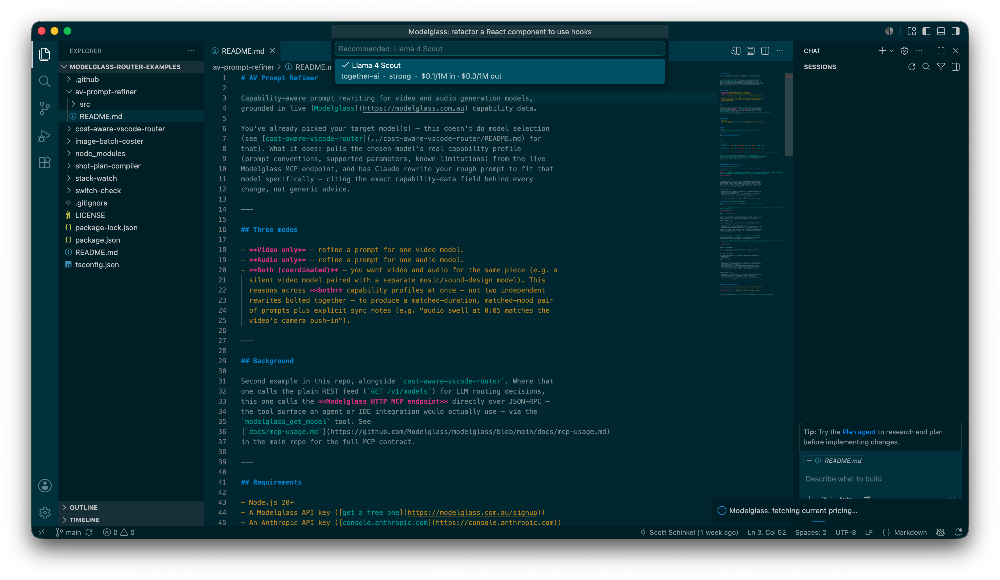
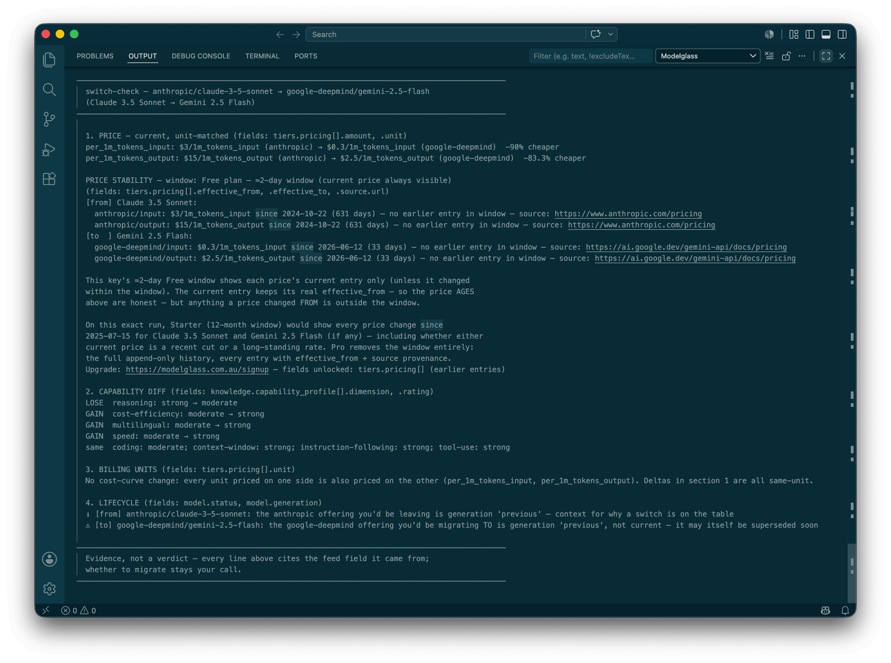

# Modelglass Cost-Aware Router

A VS Code extension that routes a task to the cheapest LLM that clears a
confirmed benchmark bar, using the live [Modelglass](https://modelglass.com.au)
pricing and capability feed. Since v0.3.0 it can also **execute the call
directly against your own provider key** — a fully client-side, BYOK
(bring-your-own-key) router: no Modelglass proxy in the request path, ever.
**Since v0.6.0, it also generates video (via Runway) and audio (via
ElevenLabs)** the same way — your own keys, no proxy — see **Generate
Video**/**Generate Audio** in [Commands](#commands) below.



There are two distinct routing commands in this extension — see
[Commands](#commands) below for exactly how they differ. **Route Task** (the
original MVP command) only *recommends* a model; it never calls any provider
API. **Run Task** (new in v0.3.0) *executes* the call, using a provider key
you supply. **Since v0.4.0, the router is also available directly inside
Copilot Chat** — see [Use inside Copilot Chat](#use-inside-copilot-chat)
below.

## Use inside Copilot Chat

New in v0.4.0. Once a provider key is configured, open Copilot Chat's model
picker and look for **Modelglass Router** — it lists 9 selectable models,
one per Run Task's existing task category (Bug fix / debug, New code
generation, Terminal/CLI/DevOps, Library-aware feature work, Refactor, Test
generation, Documentation generation, Chat/explain, Autocomplete). Pick the
one that matches what you're doing and chat normally — every message routes
through the exact same ranking, Pro/Starter fallback chain, and
`.modelglass/routing-rules.json` support as Run Task, using your own
configured key(s), with no Modelglass proxy in the request path (ADR-0012,
unchanged).

Deliberately no automatic task-classifier: nine explicit models, not one
smart one, matching this extension's existing "explicit choice over hidden
magic" philosophy for Run Task's own category picker. A model whose category
has no routable model for your configured provider(s) right now still
appears in the picker (never hidden — see [Provider API keys](#provider-api-keys)
below for the same principle applied to key setup) and responds with a clear
explanation instead of a routed answer.

Requires VS Code 1.104 or newer. On an older VS Code, this integration
silently doesn't register — every other command in this extension is
unaffected.

## Route Task to Cheapest Capable Model

1. Run **Modelglass: Route Task to Cheapest Capable Model** from the Command Palette.
2. Describe what you're about to do; the extension infers a starting task type
   (coding / writing / general) from your active file's language — always
   overridable.
3. It fetches the current LLM pricing/capability feed and recommends the
   cheapest model that clears the relevant quality bar — coding tasks are
   ranked by SWE-bench Verified, writing/general tasks by
   instruction-following rating. **Recommendation only — nothing is executed.**

## Run Task on Cheapest Capable Model (BYOK router — Starter / Pro)

1. Configure a provider key first — **Modelglass: Set Provider API Key** (see
   [Provider API keys](#provider-api-keys) below).
2. Run **Modelglass: Run Task on Cheapest Capable Model**, pick one of nine
   task categories (bug fix/debug, new code generation, terminal/CLI/DevOps,
   library-aware feature work, refactor, test generation, documentation
   generation, chat/explain, autocomplete), and describe the task. If you
   have an editor open, your current selection (or the whole file, if
   nothing's selected) is automatically attached as context — the model
   sees the code you're actually working on, not just your description of
   it. No open editor: the task runs on your typed description alone,
   exactly as before.
3. The extension ranks your configured provider's models against
   Modelglass's live benchmark/capability feed (SWE-bench Pro/Verified,
   Terminal-Bench 2.1, Aider Polyglot/LiveCodeBench, or BigCodeBench,
   depending on category — with a qualitative capability-rating fallback for
   categories no benchmark covers well) and **calls the cheapest model that
   still clears a quality bar**, using your own key — not simply the
   highest-scoring one regardless of price, matching this command's own
   name. Each of the five benchmark-scored categories has its own default
   bar (calibrated to that benchmark's real score range — e.g. 60% on SWE-bench
   Verified, 50% on Aider Polyglot); if every model in your configured
   provider(s) happens to fall below it, that's a sign the bar doesn't fit
   today's pool and the extension falls back to the highest-scoring model
   instead of reporting nothing. Supports OpenAI, Anthropic, DeepSeek, xAI,
   Mistral, Groq, Together AI, and OpenRouter. That feed is cached locally
   for ~5 minutes, so a brief Modelglass API blip doesn't block a Run Task
   call — a fetch failure past that window falls back to the last
   known-good feed instead of failing the run. The response opens in its
   own editor tab beside your code (not the Output channel) — labeled with
   the category and model that produced it, and flagged if the provider
   reports the response was cut off at its max output token limit.
4. **Starter** (one configured key): one execution attempt. A failure
   (invalid key, rate limit, network/provider error, or a request that
   times out after 60s with no response) is reported clearly — no
   automatic retry.
5. **Pro** (multiple configured keys, via **Modelglass: Add Provider API
   Key**): on a failure — including a timeout — automatically retries the
   next-best-ranked model on a *different* configured provider (never the
   same provider twice), up to one attempt per configured provider. Pro
   also unlocks an optional `.modelglass/routing-rules.json` file in your
   workspace to override the default ranking per category — exclude a
   provider, force cheapest-first ignoring quality entirely, set an exact
   model priority order, or set your own `minScore` (0–1) quality bar in
   place of the built-in per-benchmark default described above.
   `minScore`/`strategy`/`priority` only apply to the five benchmark-scored
   categories (bug fix, new code generation, terminal/CLI, library-aware
   feature work, refactor); `minScore` specifically is a no-op for the four
   categories that fall back to a qualitative capability rating (those
   already land on cheapest-among-the-top-rating-tier by default, since a
   coarse rating scale ties far more often than a continuous benchmark
   score). A Starter user with a `routing-rules.json` present, or
   attempting to configure more than one provider key, gets a clear upgrade
   prompt rather than a silent failure.

## Install

From the Marketplace (once published): search **Modelglass Cost-Aware
Router** in VS Code's Extensions view, or run:

```bash
code --install-extension modelglass.cost-aware-router
```

From a `.vsix` file directly (e.g. for testing a pre-release build):

```bash
code --install-extension path/to/cost-aware-router-0.1.0.vsix
```

### First run

No account or setup needed: the extension silently provisions its own free
Modelglass API key the first time you run a command, stored in VS Code's
`SecretStorage` — never in a settings file or anything synced elsewhere.
Look in the **Modelglass** output channel (View → Output) to confirm it
provisioned successfully. If the API is unreachable, it offers to retry or
let you enter a key manually instead. This free Modelglass key is what
**Run Task** also checks against to determine Pro vs Starter access — it's
the same key, not a separate credential.

### Provider API keys

**Run Task** needs a key from whichever LLM provider(s) you want it to call
— these are entirely separate from the free Modelglass key above, and are
never sent to Modelglass, only to the provider itself.

- **Modelglass: Set Provider API Key** — the Starter flow: pick a provider,
  paste its key. Exclusive — setting a new provider's key replaces
  whichever one was configured before (with a confirmation warning).
- **Modelglass: Add Provider API Key** — the Pro flow: pick a provider,
  paste its key, *alongside* any other already-configured provider(s) —
  this is what builds the fallback chain. Adding a first key, or rotating
  an already-configured provider's own key, is never gated; adding a
  *second* simultaneous provider requires Pro.

Both store into VS Code's `SecretStorage`, same mechanism as the free
Modelglass key.

Right after a key is saved, the extension previews which of the nine task
categories that provider actually has routable models for — registry
benchmark coverage is sparse enough that some providers/categories resolve
to zero models today, and this makes that gap visible immediately (Output
channel breakdown, plus a notification if coverage is partial or zero)
instead of discovered mid-task. Since v0.4.0, both the **Set** and **Add**
provider pickers show this same coverage (e.g. "7/9 categories routable
today") right on each provider option, before you even paste a key.

## Commands

| Command | What it does |
|---|---|
| **Modelglass: Route Task to Cheapest Capable Model** | Prompts for a task description, then *recommends* the cheapest LLM that clears the relevant quality bar for it. Coding/writing/general only. Never calls a provider API. |
| **Modelglass: Run Task on Cheapest Capable Model** | Prompts for a task category and description, then *executes* the call against the top-ranked model using your own configured provider key(s). See [Run Task](#run-task-on-cheapest-capable-model-byok-router--starter--pro) above. |
| **Modelglass: Compare Two Models** | Grounded migration diff between two models — pick a "from" model, then a "to" model (or the feed's own suggested competitors). Reports the unit-matched price delta and price *stability* (from the append-only price history), a per-dimension capability diff, billing-unit change warnings, and lifecycle checks, in the **Modelglass** Output panel. Works across image/llm/video/audio, and on every plan tier including Free. |
| **Modelglass: Set API Key** | Enter an existing free Modelglass API key, or clear the stored one (forcing re-provisioning on next use). |
| **Modelglass: Set Provider API Key** | Starter: store a single provider key (LLM execution), replacing any previous one. |
| **Modelglass: Add Provider API Key** | Pro: store an additional provider key alongside existing ones, for fallback chains. |
| **Modelglass: Generate Video (Runway)** | Starter/Pro. Picks a Runway video model (ranked cheapest-first from the Modelglass feed — 5 of the registry's 7 Runway entries are offered, see [Known limitations](#known-limitations)), prompts for a text description (plus an input image/video file when the model needs one), submits the job, and polls to completion with a cancellable progress notification. Output ratio is a fixed 1280:720 landscape default, not yet user-selectable. Saves the result to `.modelglass/generated/` and reveals it in the OS file explorer. |
| **Modelglass: Generate Audio (ElevenLabs)** | Starter/Pro. Choose Text to Speech (sync), Dub Audio/Video (async, polled with a cancellable progress notification — ElevenLabs has no confirmed dubbing-cancel endpoint, so canceling only stops this extension from waiting), or Clone a Voice (Instant Voice Cloning, sync). TTS/dubbing results save to `.modelglass/generated/` and reveal in the OS file explorer; voice cloning reports the new voice ID instead (it produces no file). |



## Scope

- **Route Task** is LLM routing only (coding + writing/general), recommendation
  only, no execution — the original MVP command, unchanged since v0.1.0.
  **Run Task** (BYOK router, v0.3.0+) is also LLM-only, but ranks across nine
  finer-grained task categories and actually executes. Neither routes
  image/video/audio.
- **Generate Video**/**Generate Audio** (BYOK, Starter/Pro) route video
  (Runway) and audio (ElevenLabs TTS/dubbing/IVC) generation specifically —
  a separate, much simpler price-only ranking (`src/media-routing-lib.ts`)
  from Run Task's nine-category benchmark ranking, since this registry has
  no capability-benchmark data for video/audio generation to rank on.
  Image generation is explicitly out of scope for now (fal.ai, the likely
  provider, isn't confirmed yet — a separate future addition). No fallback
  chain for either command, on any tier — one attempt per invocation, same
  as Route Task/Run Task, but deliberately with no same-provider retry
  either (ADR-0012 Amendment 2). **Compare Two Models** remains the only
  command that's cross-modality (image/llm/video/audio) in the sense of
  comparing *pricing* across any of them; Generate Video/Audio only
  *execute* against Runway/ElevenLabs specifically.
- **Run Task** doesn't offer the composite "agentic multi-step" category —
  that needs its own subtask-decomposition UI, not built yet. It routes one
  task to one category per invocation, same "once per invocation" scope as
  Route Task.
- Only eight providers have a working execution adapter today: OpenAI,
  Anthropic, DeepSeek, xAI, Mistral, Groq, Together AI, OpenRouter. A
  provider-API model-identifier heuristic is used (documented in
  `src/provider-execute.ts`) since Modelglass's registry doesn't carry a
  dedicated field for a provider's literal model string — OpenRouter and
  Together AI are the two providers where this heuristic is least reliable.
- No MCP exposure yet — Run Task's routing/execution is VS Code-only for now;
  exposing it as an MCP tool for agent frameworks outside VS Code is a
  possible future direction, not built.
- No escalation/usage-logging (the CLI's `report` command's feature set) — out
  of scope for this extension.
- **Copilot Chat integration (v0.4.0) is v1-scoped**: text-only (no image
  input, no tool calling — a message containing only non-text parts is
  answered as if it were empty rather than erroring), non-streaming (one
  complete response per turn, not token-by-token — VS Code's own official
  sample extension does the same, so this isn't a stopgap), and no deep
  cancellation into the underlying provider call once it's started. All
  three are real, separately-scoped follow-ups, not silently dropped.

## Known limitations

Specific to **Generate Video**/**Generate Audio** (SCO-430), called out here
rather than left implicit:

- **Video output ratio is a fixed 1280:720 landscape default** — Runway
  requires an explicit ratio for some models (Gen-4.5, Gen-4 Turbo) with no
  server-side default of its own, and this release always supplies the same
  one rather than offering a picker. Portrait/square output isn't reachable
  yet.
- **Gen-3 Alpha is not offered** — it was retired from Runway's API
  (2026-07-30) and no longer has a working model identifier, even though it
  may still show as available on [modelglass.com.au](https://modelglass.com.au)
  itself (a separate registry-data staleness issue, tracked independently).
- **Act-Two is not offered** — it requires a different Runway endpoint
  (Character Performance, a reference-video-plus-character-image input
  shape) than this release's adapter supports.
- **ElevenLabs dubbing has no confirmed cancel endpoint.** Canceling a
  dubbing job stops this extension from polling it, but the job may keep
  running (and billing) on ElevenLabs' side regardless — disclosed in the
  progress notification, not silently assumed away.

## Relationship to `cost-aware-vscode-router`

The core selection logic behind **Route Task** (`src/lib.ts`) is vendored from
[`modelglass-router-examples/cost-aware-vscode-router/src/lib.ts`](https://github.com/Modelglass/modelglass-router-examples/tree/main/cost-aware-vscode-router) —
same pricing/quality-bar logic, same tests. There's no published shared
package to depend on instead, so this is a deliberate copy, kept in sync by
hand. `requireApiKey()` (that repo's CLI-only key handling, which calls
`process.exit(1)` on failure — not safe inside an Extension Host) is replaced
entirely by `src/auth.ts`.

**Run Task** (`src/routing-engine.ts`, `src/run-task*.ts`,
`src/provider-*.ts`, `src/routing-rules*.ts`, `src/pro-gate*.ts`) is original
code written for this extension — not vendored from anywhere.

## Development

```bash
npm install
npm run typecheck
npm test
npm run build      # bundles src/extension.ts -> dist/extension.cjs via esbuild
npm run watch       # same, rebuilding on change
npm run package     # builds + bundles a .vsix via vsce
```

Press `F5` in VS Code (with this folder open) to launch an Extension
Development Host for manual testing.

## License

MIT — see [LICENSE](LICENSE). Consistent with `modelglass-router-examples`
(SCO-170) — this extension is meant to be installed, read, and adapted.
